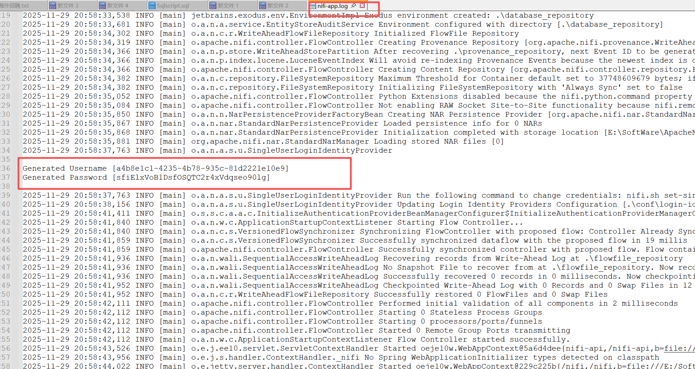

## **How to download and run the Apache NIFI 1.28 Version**
### 1. **Download the Apache NIFI version 2.3.0**
- Open [nifi official website](https://nifi.apache.org/), click `download`,you can download the latest version 2,current is `2.6.0`, and the latest version 1,`NIFI-1.28.1`;
- If you want to download the archieve version,[NIFI archieve](https://archive.apache.org/dist/nifi/) to choose your version, I select the `2.3.0`;

---
### 2. **Download the java-version**
1. In the apache nifi `version 2.x`,you need to download the `java-21` and `Python 3.10 or higher`
2. In the apache nifi `version 1.28.1`, you need to download `java 17`
3. Open [Java_archieve](https://www.oracle.com/java/technologies/downloads/archive/) to download your wanted java version;

---
### 3. **NIFI Configuration**
1. `nifi.properties`
- nifi.flow.configuration.archive.max.time=15 days  
change nifi.flow.configuration.archive.max.time as 15 days, I think 15 days is enough.
- nifi.queue.backpressure.size=2 GB
 2G is good for you to sync large data when you use executedSQL.
- command the `nifi.web.http` config
```text
# nifi.web.http.host=
# nifi.web.http.port=
# nifi.web.http.network.interface.default=
```
2. `bootstrap.conf`
- JVM memory settings
- 2.1 for production environment:
- - Setting the minimum running memory as 50% your windows running memory is better.
- - Setting the maximum running memory as 75%-85% your windows running memory is better.
- 2.2 for dev environment:
- - follow my setting is okay.

```text
# JVM memory settings
java.arg.2=-Xms4g
java.arg.3=-Xmx8g
```

3. `nifi-env.cmd`
replace the `nifi-env.cmd`content
```ps
@echo off
rem Set Java version
rem if you have multiple java version, use the fully path to do it.
set JAVA_HOME="C:\Program Files\Java\jdk-17" 

rem Set application home directory
set NIFI_HOME="E:\SoftWare\ApacheNIFI\nifi-1.28.1"

rem Set run directory for process identifier tracking
set NIFI_PID_DIR=%NIFI_HOME%\run

rem Set application log directory
set NIFI_LOG_DIR=%NIFI_HOME%\logs

```

4. `nifi.cmd`
replace the `nifi.cmd` content
```ps
@echo off

rem set JAVA_EXE and NIFI_HOME directory
set JAVA_EXE=C:\Program Files\Java\jdk-17\bin\java.exe
set NIFI_HOME=E:\SoftWare\ApacheNIFI\nifi-1.28.1

echo Checking Java installation...
if not exist "%JAVA_EXE%" (
    echo ERROR: Java not found at %JAVA_EXE%
    pause
    exit /b 1
)

echo Checking NiFi installation...
if not exist "%NIFI_HOME%" (
    echo ERROR: NiFi home not found at %NIFI_HOME%
    pause
    exit /b 1
)

set BOOTSTRAP_LIB_DIR=%NIFI_HOME%\lib\bootstrap
set CONF_DIR=%NIFI_HOME%\conf
set NIFI_LOG_DIR=%NIFI_HOME%\logs

set LOG_DIR_PROPERTY=-Dorg.apache.nifi.bootstrap.config.log.dir=%NIFI_LOG_DIR%
set CONFIG_FILE_PROPERTY=-Dorg.apache.nifi.bootstrap.config.file=%CONF_DIR%\bootstrap.conf
set PROPERTIES_FILE_PROPERTY=-Dnifi.properties.file.path=%CONF_DIR%\nifi.properties
set BOOTSTRAP_HEAP_SIZE=48m

set JAVA_ARGS=%LOG_DIR_PROPERTY% %CONFIG_FILE_PROPERTY%
set JAVA_PARAMS=-cp "%BOOTSTRAP_LIB_DIR%\*;%CONF_DIR%" %JAVA_ARGS%
set JAVA_MEMORY=-Xms%BOOTSTRAP_HEAP_SIZE% -Xmx%BOOTSTRAP_HEAP_SIZE%

echo Starting NiFi...
pushd "%NIFI_HOME%"

set RUN_COMMAND=%~1
if "%RUN_COMMAND%" == "" set RUN_COMMAND=run

if "%RUN_COMMAND%" == "start" (
    start /MIN "Apache NiFi" "%JAVA_EXE%" %JAVA_MEMORY% %JAVA_PARAMS% org.apache.nifi.bootstrap.BootstrapProcess %RUN_COMMAND%
) else (
    "%JAVA_EXE%" %JAVA_MEMORY% %JAVA_PARAMS% org.apache.nifi.bootstrap.BootstrapProcess %RUN_COMMAND%
)

popd
pause
```
---

### 4. **run nifi**
1. cd the nifi bin folder
2. run the cmd command
```ps
nifi.cmd start
```


3. go to the [nifi web home](https:localhost:8443/nifi/),you will see the nifi-login screen


4. find the `user` and `password` in the `nifi-app.log` file
find the `Generated Username` in the `nifi-app.log` file
```text
Generated Username [a4b8e1c1-4235-4b78-935c-81d2221e10e9]
Generated Password [sfiElxVoB1DsfOSQTC2r4xVdqseo90lg]
```



`copy and save the user`

5. login,you will see the nifi home screen, you can start you nifi journey now.

