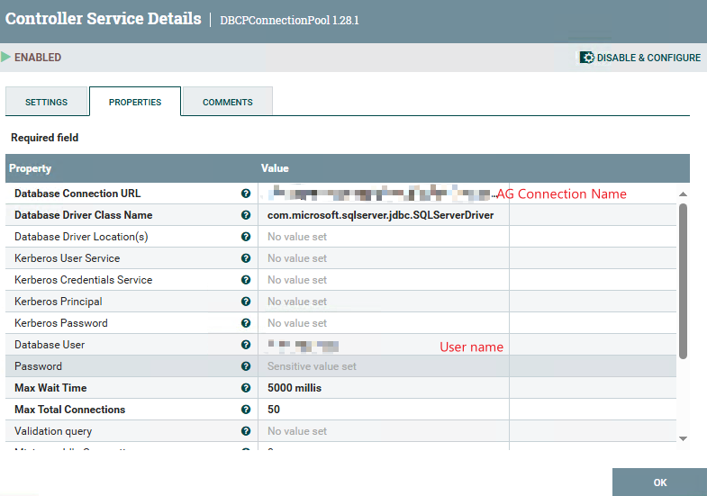

## **Using ApacheNIFI to connect SQL Server alwayson secondary db**
In the NIFI controllerService,input the AG name

`jdbc:sqlserver://AG:1433;databaseName=YourDB;encrypt=false;encrypt=false;applicationIntent=ReadOnly;multiSubnetFailover=true;`

---
## **Using ApacheNIFI to connect SQL Server alwayson primary db**
In the NIFI controllerService,input the AG name

`jdbc:sqlserver://AG:1433;databaseName=YourDB;encrypt=false;trustServerCertificate=true;multiSubnetFailover=true;applicationIntent=ReadWrite`;

---