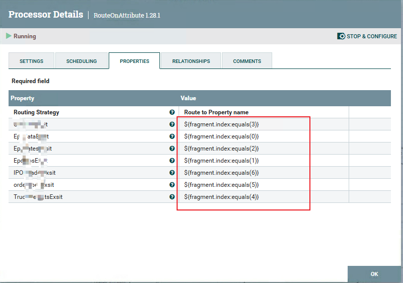
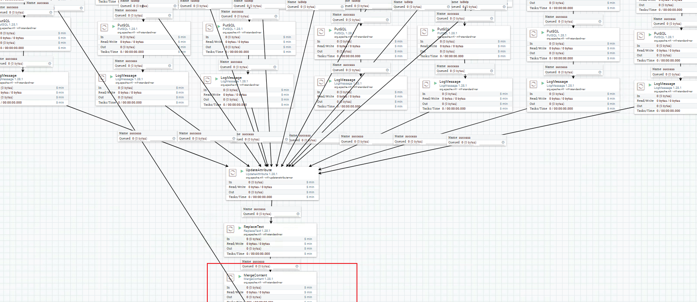

## **Using fragment.index to define route after splitJson**
### 1. **Scenario** 
After get respond data from `InvokeHttp` processor,we get the complicated Json.However,each child Json corresponds to different business.After split Json, we don't know which queue map correspond business. What should we do?
### 2. **Solution**
- 1. If the Json structure is fixed. We can use `fragment.index` to control different route after splitJson.
    
 
- 2. The flow like this 
    
 
- 3. Using `MergeContent` judge every child flow is end or not. Deal with final process
    

