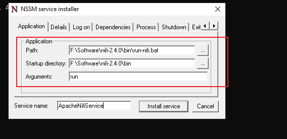
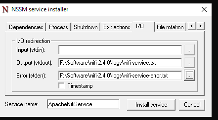
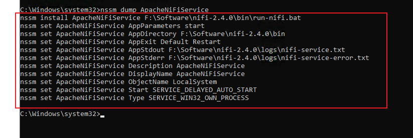

## **How to use `NSSM` tool to register Apache NIFI as windows service**

[Youtube Video Link](https://www.youtube.com/watch?v=FYR_PDuuafg)

### 1.Download NSSM
- Open the [NSSM offcial Website](https://nssm.cc/download) to down `nssm-2.24-101-g897c7ad.zip` file;
- Then, extract the zip file to NSSM folder;
- Next, add the **`nssm win64`** or **`win32`** to system `environment path`;
- Finaly, run `nssm -v` to check NSSM install success or not;

```ps
nssm -v
```


---
### 2. Create `run-nifi.bat` file
Create `run-nifi.bat` file in the bin folder,the file content is:

```ps
@echo off
rem ============================================================================
rem  Apache NiFi - Run NiFi in background automatically (Windows)
rem ============================================================================

rem --- Load environment variables ---
if exist "%~dp0\nifi-env.cmd" (
    call "%~dp0\nifi-env.cmd"
) else (
    echo ERROR: nifi-env.cmd not found in %~dp0
    exit /b 1
)

rem --- Start NiFi in background ---
echo Starting Apache NiFi in background...
call "%~dp0\nifi.cmd" start
if errorlevel 1 (
    echo ERROR: NiFi failed to start.
    exit /b 1
) else (
    echo NiFi started successfully.
)

```
---
### 3.Using nssm to register is as windows service
1. Install ApacheNifiService
   

2. Set Service detail
   

3. Set Service output and error log
   

4. Start service
   

---

### 4.View your service
```ps
nssm dump ApacheNifiService
```
