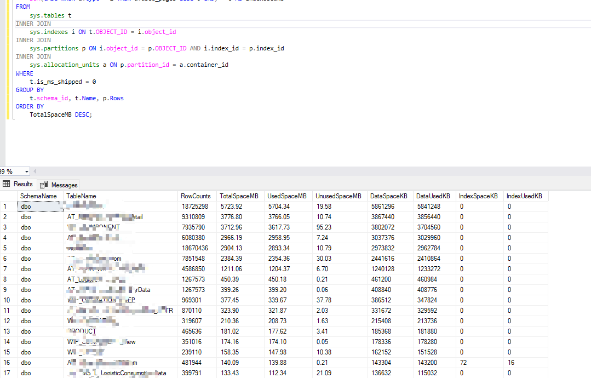

## **Query the space usage in the SQL Server**
With the table rows incresement. We want to know the table space usage. After do this, we can do some actions to incease hard disk, optimze index and split table.

```sql
use yourDB;
-- Query the space usage of all tables
SELECT 
    SCHEMA_NAME(t.schema_id) AS SchemaName,
    t.NAME AS TableName,
    p.rows AS RowCounts,
    CAST(ROUND((SUM(a.total_pages) * 8) / 1024.00, 2) AS NUMERIC(36, 2)) AS TotalSpaceMB,
    CAST(ROUND((SUM(a.used_pages) * 8) / 1024.00, 2) AS NUMERIC(36, 2)) AS UsedSpaceMB, 
    CAST(ROUND(((SUM(a.total_pages) - SUM(a.used_pages)) * 8) / 1024.00, 2) AS NUMERIC(36, 2)) AS UnusedSpaceMB,
    -- Data
    SUM(CASE WHEN a.type = 1 THEN a.total_pages ELSE 0 END) * 8 AS DataSpaceKB,
    SUM(CASE WHEN a.type = 1 THEN a.used_pages ELSE 0 END) * 8 AS DataUsedKB,
    -- Index
    SUM(CASE WHEN a.type = 2 THEN a.total_pages ELSE 0 END) * 8 AS IndexSpaceKB,
    SUM(CASE WHEN a.type = 2 THEN a.used_pages ELSE 0 END) * 8 AS IndexUsedKB
FROM 
    sys.tables t
INNER JOIN      
    sys.indexes i ON t.OBJECT_ID = i.object_id
INNER JOIN 
    sys.partitions p ON i.object_id = p.OBJECT_ID AND i.index_id = p.index_id
INNER JOIN 
    sys.allocation_units a ON p.partition_id = a.container_id
WHERE 
    t.is_ms_shipped = 0
GROUP BY 
    t.schema_id, t.Name, p.Rows
ORDER BY 
    TotalSpaceMB DESC;
```

