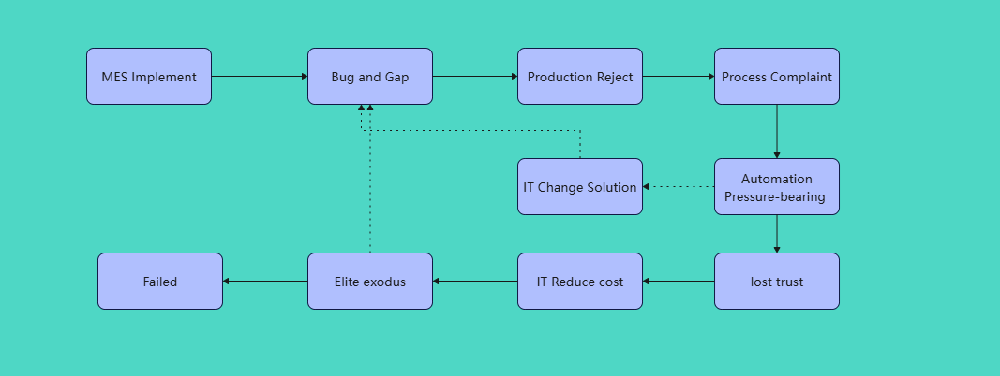

## MES Consultant Practical Guide
---
### 1.Preface

As an MES Consultant with over a decade of deep experience in manufacturing IT, I have worked across a wide range of enterprises: listed manufacturers in the Beijing-Tianjin-Hebei Economic Belt, small to mid-sized 3C manufacturers in the Pearl River Delta, listed private enterprises in Huawei’s supply chain, a smart manufacturing solution vendor, and a leading European and American wholly owned commercial vehicle company.

Through these roles, I have gained hands-on experience in large, medium, small and micro-sized enterprises, and adapted to the distinctly different management mindsets of private and foreign-owned companies.

Over the years, I have not only been deeply embedded in China’s three core manufacturing hubs—the Beijing-Tianjin-Hebei region, the Pearl River Delta and the Yangtze River Delta—but also conducted on-site visits to overseas manufacturing clusters in northern Vietnam and the Penang–Kuala Lumpur corridor in Malaysia. My industry coverage includes OLED, PCB, 3C electronics, lithium-ion batteries and commercial vehicles. I have been deeply involved in production line operation & system development, legacy MES optimization, greenfield factory digitalization built from scratch, legacy system replacement, and full-cycle project delivery and implementation.

Across these diverse projects, I have repeatedly observed the same pattern: many MES projects appear complete on paper—with well-developed modules and seemingly sound business logic, giving the impression of a fully usable system. Yet once deployed on the shop floor, they run into persistent issues: functions fail to match real production conditions, bugs and process gaps emerge constantly, and the data acquisition pipeline is incomplete. When senior management needs key metrics for decision-making, they find data missing or inaccurate, leaving the system unable to truly support management.

Over time, business and production teams gradually lose trust in MES and IT, and the entire factory begins to question the value of digital transformation.
Looking back at these projects, companies have invested heavily: hiring professional consulting teams for planning, building development and product teams, setting up factory automation departments, and securing full collaboration between business and IT. Yet the actual on-site results still fall far short of expectations.

Why do so many seemingly complete systems fail to deliver real value on the factory floor?

In this article series, I will share my on-the-ground observations and insights from the perspective of a frontline manufacturing IT MES consultant. Focusing on **shop-floor production, supply chain collaboration, end-to-end cost accounting, workshop workforce management and business process alignment**, I will reflect on the pitfalls and lessons learned from real-world implementations. My hope is to provide practical, field-based references for fellow professionals working in factory digitalization.

---

### 2.Catalog

1. **MES Consultant Guid-1-MES Developer/Consultant Skill Requirements**
   
2. **MES Consultant Guid-2-Why MES Consultants Must Understand Factories**
   
3. **MES Consultant Guid-3-Why MES Consultants Need to Master Product and Process Technologies**
   
4. **MES Consultant Guid-4-Why MES Consultants Should Understand Production Equipment**
   
5. **MES Consultant Guid-5-How MES Consultants Build Strong Partnerships with Business Departments**
   
6. **MES Consultant Guid-6-How to Quickly Understand a New Factory**
   
7. **MES Consultant Guid-7-How to Quickly Learn the Functions of a New MES System**
   
8. **MES Consultant Guid-8-How to Quickly Get Familiar with a New MES Database and Tables**
   
9.  **MES Consultant Guid-9-How to Quickly Understand a New MES System Architecture and Code**
    
10. **MES Consultant Guid-10-How to Quickly Evaluate MES Implementation Performance on the Shop Floor**

