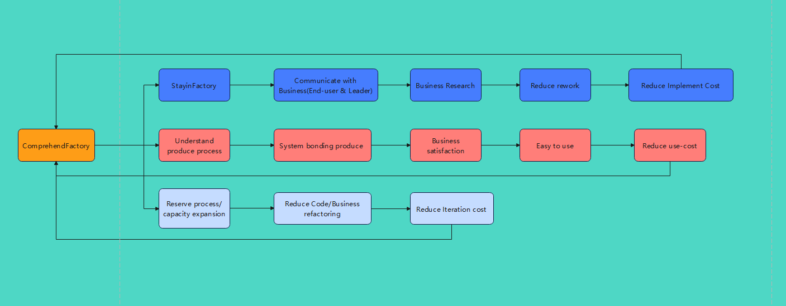
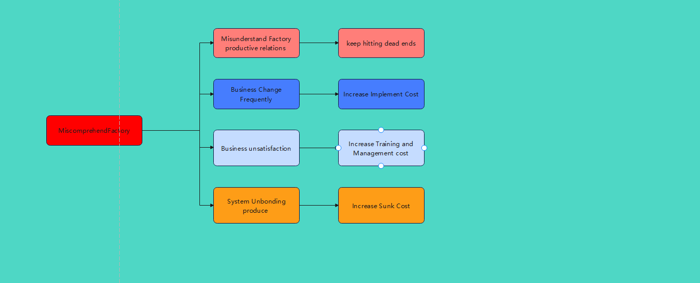

## **Preface**  

Why MES Consultants Must Deeply Understand the Factory?

Having led and reviewed dozens of MES implementations across industries, I have repeatedly seen the same pattern: MES consultants who lack deep factory knowledge — or, in extreme cases, have never stepped onto the production floor — produce systems that fail to meet business needs. Instead of enabling production, these systems become expensive obstacles, creating friction, resistance, and hidden waste.

This article explains, from two fundamental viewpoints —> **First Principles** and **Economic Reality (Cost)**  why a MES consultant **must** truly understand the factory.

### 1. First Principles Perspective

First Principles thinking, popularized by Elon Musk, means breaking a problem down to its most fundamental, undeniable truths and reasoning upward from there —> never by analogy, experience, or **best practices**.

#### 1.1 The Factory’s First Principle

From first principles, a factory is simply a **physical material transformation system**.  

Its sole purpose, under the immutable constraints of **time, space, materials, equipment, processes, and people**, is to convert raw materials → semi-finished products → finished goods.  

The ultimate objective is to achieve this transformation with **minimum waste, maximum efficiency, and the highest stable quality**.

Every production management practice, process, policy, KPI, and rule exists **only** to serve this physical reality. Any procedure or system that violates it is not management — it is pseudo-management that generates waste and parasitic relationships.

#### 1.2 The MES First Principle
MES was born because advancing technology (especially computing power) created the need for a digital tool to reduce the management and production burden in physical factories.  

**MES = Digital Mirror of Production Execution + Closed-Loop Control System.**  

MES is *not* an independent software product. It is parasitic on, dependent on, and exists solely to serve the physical production process. Its single mission is:  
**Eliminate information asymmetry → Reduce waste in physical transformation → Improve conversion efficiency**.

#### 1.3 The MES Consultant’s First Principle

A MES consultant is the role responsible for designing, implementing, and continuously optimizing this digital mirror.  

The absolute prerequisite for doing the job correctly is:
**First fully understand the physical constraints of the factory, then design the digital mapping**.

#### 1.4 First Principles Conclusion

If a MES consultant does not deeply understand the factory’s material transformation process and production relationships, they are rejecting the factory’s first principle. This automatically violates the MES first principle. The inevitable result is a system that:

- Conflicts with real-world physical logic  
- Breaks process flows  
- Produces false data in reports and dashboards  
- Becomes unusable on the shop floor  

**Bottom line**: The factory is the *necessary precondition* for MES to exist. An MES consultant who does not understand the factory is building a system without theoretical foundation — and it will collapse.

### 2. Cost (Economic) Perspective

Every factory decision ultimately returns to one truth: **the factory must generate profit**. 

**Profit = Revenue – Total Cost**. 

MES is a direct lever for controlling and optimizing **manufacturing-side costs**.

#### 2.1 Factory Cost Structure

Factory costs are divided into **explicit** and **implicit** (hidden) costs.  
Only about 5 % of people focus on explicit costs; 94 % lack any real cost awareness.

**Explicit costs** (visible): labor, materials, energy (water/electricity), equipment depreciation, software licenses, and implementation fees.  

**Implicit costs** (far larger and often ignored): waiting time, WIP accumulation, changeover losses, downtime, rework/scrap, traceability errors, material shortages halting lines, duplicate data entry, inventory capital tie-up, scheduling waste from incorrect information, and escalating “public relations” (internal politics) costs.

MES’s true value lies in systematically reducing these **implicit costs**.

#### 2.2 Marginal Benefit Principle

MES should never be evaluated by “more functions = better” or “higher price = better.”  

The only correct metric is **highest marginal benefit** — the additional value created per additional unit of investment.

Different industries require completely different MES priorities because their marginal returns differ:

- **Automotive**: Focus on takt time, poka-yoke (error-proofing), and andon systems → low investment, extremely high return.  
- **3C (electronics)**: Focus on process routing, WIP visibility, and material kitting → different investment profile.  
- **Chemical/Pharma**: Focus on batch control, recipe management, and process parameters → entirely different module set.

Consultants who ignore marginal benefit simply pile on features(over-investment → collapsing marginal returns)or miss critical modules (core pain points remain unsolved → investment and return become disconnected).

#### 2.3 MES Lifecycle Costs
MES is never a one-time purchase. It incurs three major cost categories over its life:

1. **Implementation costs** (requirements gathering, design, development, training)  
2. **Operational costs** (operator learning curve, data entry, error correction, daily maintenance)  
3. **Iteration costs** (capacity expansion, product changes, process modifications)

**Consultants who truly understand the factory**:

- Spend time on the shop floor, talk directly to operators and leaders, conduct multiple field validations → dramatically reduce rework and implementation costs.  
- Design processes that match reality → easy to learn and use → lower operational costs.  
- Anticipate future process and capacity changes → minimal reconfiguration → lower iteration costs.

**Consultants who do not understand the factory**:

- Constantly revise requirements → implementation costs double or triple.  
- Misread production relationships → constant resistance and friction.  
- Face shop-floor pushback → training and management costs explode.  
- Build rigid systems → any process change renders the system obsolete → massive sunk costs.

#### 2.4 Economic Conclusion
MES is the virtual mapping and control layer of the factory’s physical manufacturing and management processes — not a generic internet-style application.  
A MES consultant who misunderstands the factory creates management chaos and enormous hidden waste, ultimately generating huge sunk costs for the plant.

### 3. Final Summary
- **From First Principles**: The factory is the physical reality; MES is its digital reflection. Without understanding the physical reality, you cannot create a correct digital reflection.  
- **From Economic Reality**: The factory exists to generate profit; MES is a tool for reducing manufacturing and management costs. Without factory knowledge, IT investment and actual returns become completely disconnected.

## Conclusion
A MES consultant who does not deeply comprehend the factory is not merely “less effective” — they are fundamentally unqualified. True MES success is impossible without this foundational understanding.

This is not a theoretical opinion. It is the hard-earned lesson from every failed MES project I have witnessed — and every highly successful one I have helped deliver.  

The factory is the teacher. The best MES consultants never stop learning from it.