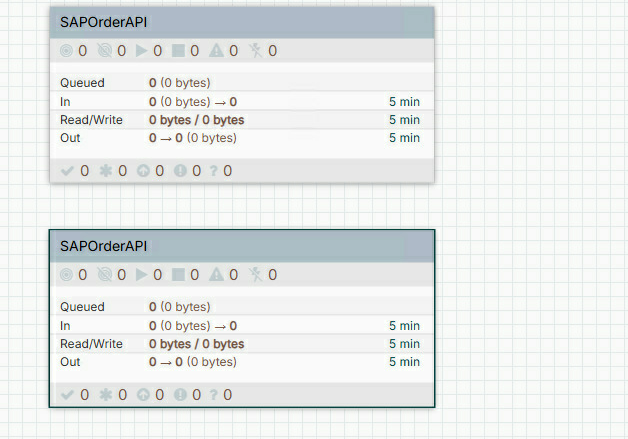
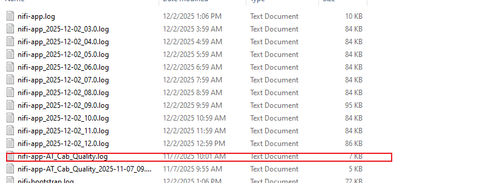

## **1.Group**
---
### 1. **What is nifi group?**
`NIFI Group` is a `business and function component cluster`. In this group, you can have `multiple childer groups`.

You can add so many processors in your group. You can use line to connect each processor to realize your business logic.

::: warning
You also can add multiple business logic in your group.^`Not recommand`
:::

---
### 2. Group attributes
1. Each Group has unique uuid.
     
2. You can have the same name group^`Not recommand`
   
3. `Log File Suffix`
   Generate a new log file, the file name is your `Log File Suffix` name.

::: tip
   1. If there are so many groups in your ETL. In your `nifi-app.log` file, there are large mess message in your file. You can't address your wanted log information.According to this scenario.You need to separte the log file. So,you need add the name in the `Log File Suffix`.

   2. Multiple group can share the same log file as  you set `Log File Suffix` value
   
:::

    
4. Default Back Pressure Object Threshold
   - Default vaule:1000
   - If your group has multiple children groups, you can change this value.
5. Default Back Pressure Object Threshold
   - Default vaule:2G
   - If your business need insert or update large data, you can adjust this value.
6. Comments
   - Add comments when you collaborate with your team.