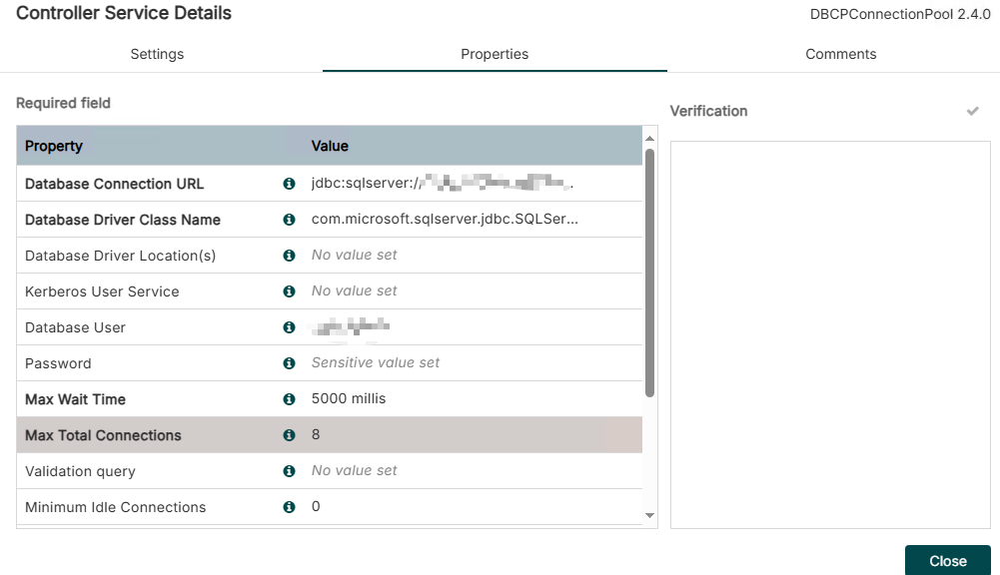

## **2.Controller-services**
- [Video Link](https://youtu.be/UV8oaJngS1k)
---

### 1. **What is Controller-services?**
Controller-services is nifi services cluster. You can easy add DB connect, Json reader and writer, kafka and cache services in your ETL.

---
### 2. **Common services**
- **DB Connection service**:`DBCPConnectionPool`
- **Json operation**:`JsonRecordSetWriter` and `JsonTreeReader`
- **Cache**: `DistributedMapCacheLookupService`
- **XML**: `XMLReader` and `XMLRecordSetWriter`

---
### 3. **Add DBCPConnectionPool SQL Server**

1. Open [Microsoft JDBC official website](https://learn.microsoft.com/en-us/sql/connect/jdbc/download-microsoft-jdbc-driver-for-sql-server), click `previous Microsoft JDBC Driver for SQL Server releases`,find `sqljdbc_12.6.2.0_enu`,then download
2. Extract this zip file to your customer folder,
3. copy `mssql-jdbc-12.6.2.jre11.jar` to the `Apache NIFI lib` folder
4. Config `DBCPConnectionPool` properties
- **Database Connection URL**: jdbc:sqlserver://your-server:1433;databaseName=your-db
- **Database Driver Class Name**: com.microsoft.sqlserver.jdbc.SQLServerDriver
- **Database User**: your-username
- **Password**: your-password
- **Max Wait Time**: 5000 millis
- **Max Total Connections**: 50

 
